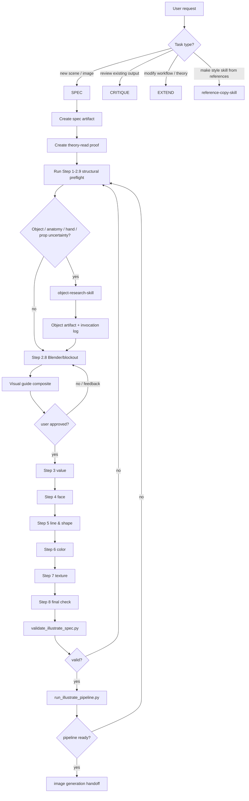

# Illustrate Skill 사용설명서

> 경로: `illustrate-skill/`
> 목적: 장면 아이디어를 바로 이미지 생성으로 보내지 않고, **이론 → 결정 → 실행 → 출력 → 게이트** 순서로 검증 가능한 일러스트 설계서로 바꾸는 워크플로우.

---

## 1. 한 줄 요약

`illustrate-skill`은 그림을 “감으로 예쁘게” 만드는 도구가 아니라, 다음 체인을 강제로 통과시키는 **일러스트 제작 SOP**다.

```text
사용자 요청
  -> 모드 선택 SPEC / CRITIQUE / EXTEND
  -> 이론 파일 읽기
  -> Step 1~8 설계
  -> 필요 시 object-research-skill 호출
  -> render-bound면 Blender/3D blockout 증거 생성
  -> scale-critical이면 문/승객 옆 임시 adult dummy로 크기 투영
  -> dummy는 숨기고 측정선/기준선만 남김
  -> visual guide composite 생성
  -> 사용자 확인/피드백 반영
  -> validate_illustrate_spec.py 검증
  -> run_illustrate_pipeline.py 최종 게이트
  -> image generation handoff
```

핵심은 **최종 이미지보다 먼저 구조와 판단 근거를 고정**하는 것이다.

---

## 2. 폴더 구조

```text
그림그리기/
├─ illustrate-skill/
│  ├─ SKILL.md
│  ├─ references/
│  │  ├─ domain_context.md
│  │  ├─ main-process.md
│  │  ├─ style-guide.md
│  │  ├─ theory-01-intent.md
│  │  ├─ theory-02-composition-silhouette.md
│  │  ├─ theory-02b-balance-cog.md
│  │  ├─ theory-02c-anatomy-structure-gate.md
│  │  ├─ theory-02d-geometric-blockout.md
│  │  ├─ theory-03-lighting-value.md
│  │  ├─ theory-04-face-eyes.md
│  │  ├─ theory-04a-face-emotion-patterns.md
│  │  ├─ theory-05-line-shape.md
│  │  ├─ theory-05a-hands-fingers.md
│  │  ├─ theory-06-color-palette-point.md
│  │  ├─ theory-07-texture-density.md
│  │  └─ theory-08-final-check-correction.md
│  └─ evals/
│     └─ test-cases.md
├─ object-research-skill/
├─ reference-copy-skill/
├─ derived-style-skills/
├─ templates/
│  ├─ illustrate-spec-template.md
│  ├─ theory-read-proof-template.md
│  ├─ object-research-artifact-template.md
│  └─ object-research-invocation-log-template.md
├─ scripts/
│  ├─ validate_illustrate_spec.py
│  ├─ run_illustrate_pipeline.py
│  ├─ create_visual_guide_composite.py
│  ├─ create_image_gen_handoff_package.py
│  └─ log_object_research_invocation.py
├─ illustration-library/
│  ├─ object_cards/
│  └─ scene_recipes/
└─ .omx/
   └─ runs/
```

### 역할 요약

| 위치 | 역할 |
|---|---|
| `illustrate-skill/SKILL.md` | 사용 규칙, 모드, 필수 게이트, 다른 스킬과의 연결 규칙 |
| `references/main-process.md` | Step 1~8 전체 제작 프로세스 본문 |
| `references/theory-*.md` | 각 단계에서 읽어야 하는 이론 모듈 |
| `templates/illustrate-spec-template.md` | render/image-generation용 설계서 양식 |
| `templates/theory-read-proof-template.md` | 이론 파일을 실제로 읽었는지 기록하는 증거 양식 |
| `templates/object-research-*.md` | object-research handoff 증거 양식 |
| `scripts/validate_illustrate_spec.py` | SPEC 구조 검증기 |
| `scripts/run_illustrate_pipeline.py` | 이미지 생성 직전 최종 게이트 |
| `scripts/create_image_gen_handoff_package.py` | source/composite/lineart/depth를 실제 image input stack으로 묶는 handoff manifest 생성 |
| `object-research-skill/` | 소품, 배경, 인체, 손, 무기, 구조물 조사/카드화 |
| `reference-copy-skill/` | 레퍼런스 폴더를 기반으로 파생 스타일 스킬 생성 |
| `derived-style-skills/` | Redjuice/Huke 등 파생 스타일 wrapper |

---

## 3. 핵심 철학

### 3.1 Theory-first

각 단계는 다음 순서를 따른다.

```text
THEORY
  -> DECISION RULE
  -> EXECUTION
  -> OUTPUT
  -> CHECK / GATE
```

즉, “이 단계에서 무엇을 결정해야 하는지”를 이론 파일에서 먼저 읽고, 그 이론을 구체적인 결정 규칙으로 바꾼 다음 실행한다.

### 3.2 Spec-first

최종 이미지를 만들 요청이면, raw prompt를 바로 이미지 생성기로 보내지 않는다.

반드시 먼저:

1. `illustrate-spec-template.md`에서 spec artifact 생성
2. `theory-read-proof-template.md`에서 proof artifact 생성
3. Step 1~8 채우기
4. 필요하면 object research artifact 생성
5. render-bound면 Blender pass에서 visual guide composite 생성
6. composite를 사용자에게 보여주고 피드백/승인 기록
7. 검증기 통과
8. pipeline 통과
9. 그 다음 image generation

### 3.3 Structure-before-style

스타일, 색, 질감보다 먼저 고정해야 하는 것:

- 의도
- 구도
- 투시
- 오브젝트 목록
- 인체 구조
- 손/소품 접촉
- 3D primitive/blockout
- 비례, 접지, 지지, 스케일

스타일은 이 구조 위에 얹는다.

---

## 4. 모드 구조

`illustrate-skill`은 세 가지 모드로 움직인다.

```text
SPEC      : 새 그림/장면을 설계한다.
CRITIQUE  : 기존 그림/프롬프트/설계서를 단계별로 진단한다.
EXTEND    : 이론 파일이나 프로세스 자체를 확장한다.
```

### 4.1 SPEC

사용자가 “그려줘”, “구도 잡아줘”, “이미지 만들어줘”, “이 장면 설계해줘”라고 할 때 기본 모드다.

결과물:

- staged illustration spec
- 필요 시 object research artifact
- image-generation handoff prompt

### 4.2 CRITIQUE

이미 나온 그림이나 프롬프트를 평가할 때 사용한다.

출력 구조:

```text
User Verdict
System Read
  - intent
  - process
  - readability
  - delivery
Agreement / Tension
Next Move
```

중요: 사용자가 “별로다”, “이건 안 맞다”라고 판정하면 그 판정이 1차 verdict다. 시스템은 그 이유를 진단한다.

### 4.3 EXTEND

새 그림 이론을 추가하거나 기존 process mapping을 바꿀 때 사용한다.

예:

- 손 이론 추가
- 얼굴 감정 패턴 이론 추가
- 새로운 단계 이론 파일 분리
- `main-process.md`에 이론 매핑 추가

---

## 5. 전체 실행 체인

### 5.1 최상위 체인



### 5.2 Artifact 체인

```text
SPEC file
  ├─ points to theory-read proof
  ├─ may point to object-research artifact
  │    └─ points to object-research invocation log
  ├─ points to Blender .blend file
  ├─ points to Blender render script
  ├─ points to pass outputs: clay / lineart / depth / normal / mask
  ├─ points to visual guide composite PNG
  ├─ records user visual-guide feedback and approval status
└─ contains final FINAL_IMAGE_PROMPT_COMPILED
```

예시 경로:

```text
.omx/runs/20260425-huke-brs-umbrella-spec.md
.omx/runs/20260425-huke-brs-umbrella-theory-read-proof.md
.omx/runs/20260425-huke-brs-umbrella-object-research.md
.omx/runs/20260425-huke-brs-umbrella-object-research-log.md
.omx/runs/20260425-huke-brs-umbrella/blockout-clay.png
.omx/runs/20260425-huke-brs-umbrella-pipeline-prompt.txt
```

### Legacy spec archive

기존 per-image spec은 기록 보존용으로 `.omx/archive/legacy-per-image-specs-20260430/`에 분리한다.
새 그림 작업 중에는 이 archive를 기본 검색/참조 대상으로 삼지 않는다.

```text
normal work: templates/illustrate-spec-template.md에서 새 spec 생성
legacy inspection: 사용자가 archived path를 명시했을 때만 읽기
```

---

## 6. SPEC 단계별 로직

## Step 1 — Intent

**목적:** 그림이 보여줄 순간을 한 문장으로 고정한다.

결정해야 할 것:

- 시간/조명
- 환경
- 인물 역할
- 현재 행동
- 감정축 1~2개
- 관객이 먼저 느껴야 할 감정

출력 필드:

```text
SCENE_INTENT_SENTENCE
ENVIRONMENT
TIME_OR_LIGHTING
ROLE
ACTION
EMOTION_AXIS
AUDIENCE_FEELING
```

실패 조건:

- “멋진”, “예쁜”, “분위기 있는”처럼 이미지화가 안 되는 추상어만 있음
- 누가/어디서/무엇을 하는지가 없음
- 감정축이 너무 많음

---

## Step 2 — Silhouette & Composition

**목적:** 얼굴 디테일 전에 한눈에 읽히는 큰 구도와 실루엣을 잡는다.

결정해야 할 것:

- 첫 초점
- 구도 타입: 삼분할 / 중심 / 대칭 / 비대칭 / 대각선
- 사용자 카메라 클래스: extreme wide / wide / full-body / medium / close portrait 등
- 카메라 잠금 수준: `soft`, `hard`, `adaptive`
- 카메라-스케일 충돌 여부
- 검은 덩어리 위치
- negative space 비율
- 시선 흐름과 회수 경로
- 손, 소품, 배경 구조가 연구 대상인지 여부
- 서 있는 포즈면 지지 다리와 무게중심

출력 필드 예:

```text
THUMBNAIL_SET
CHOSEN_COMPOSITION_TYPE
CHARACTER_POSITION
CAMERA_ANGLE
USER_CAMERA_CLASS_PRESET
USER_CAMERA_CLASS_LOCK_LEVEL
USER_CAMERA_CLASS_REASON
CAMERA_CLASS_CONFLICT_STATUS
CAMERA_CLASS_RESOLUTION
CHOSEN_CAMERA_CLASS
CAMERA_CLASS_VISUAL_TRANSLATION
BLACK_MASS_MAP
NEGATIVE_SPACE_BALANCE
FLOW_DIRECTION_MAP
COMPOSITION_OBJECT_ROLE_SUMMARY
```

게이트:

- 축소해도 실루엣이 읽히는가?
- 얼굴/몸/팔/소품이 뭉개지지 않는가?
- 시선이 화면 밖으로 도망가지 않는가?
- 포즈가 물리적으로 지지되는가?
- 사용자가 지정한 카메라 클래스가 구조 목표와 충돌하지 않는가?
- 사람/전차/건물처럼 스케일이 중요한 경우 close-up/medium/hero shot이 자동으로 scale proof를 망치지 않는가?

---

## Step 2.1 — Perspective Rig

**목적:** 배경과 오브젝트를 넣기 전에 카메라와 투시 시스템을 고정한다.

결정해야 할 것:

- 카메라 위치와 높이
- horizon line
- vanishing point
- 주 depth axis
- support plane
- contact plane
- vertical plane lock
- scale anchor
- scale-critical shot class
- full container visibility
- visible scale witnesses: doors/windows/passengers/modules
- camera cut / scale adjustment perspective calculation

카메라 컷이나 스케일 조정 명령이 있으면 다음 체인을 반드시 기록한다.

```text
PERSPECTIVE_SCALE_TRANSFER_MODE
HERO_FOOTPOINT_PLANE
BASELINE_OBJECT
PROJECTED_BASELINE_TO_HERO_POSITION
SCREEN_OCCUPANCY_IS_DERIVED
SCREEN_OCCUPANCY_MUST_NOT_OVERRIDE_WORLD_SCALE
CAMERA_CUT_SCALE_RECONCILIATION
```

주인공 근처에 문을 항상 배치해야 하는 것은 아니다. 대신 문/승객/창문/차량 폭 같은 기준 길이를
주인공 발 위치의 support/depth plane으로 투영해 계산해야 한다. 화면 점유율은 카메라와 크롭에서
파생된 결과이지, 실제 세계 스케일을 덮어쓰는 값이 아니다.

이 단계가 없으면 배경 오브젝트가 “멋진 디테일”처럼 보여도 실제 공간으로는 무너진다.

---

## Step 2.2 — Object Inventory from Perspective

**목적:** 장면 안의 모든 구조적 오브젝트를 투시 평면별로 목록화한다.

분류:

```text
SOURCE_IMAGE_OBJECTS_PRESENT
PRIMARY_RETAINED_OBJECTS
STRUCTURALLY_CLEAR_SOURCE_OBJECTS
STRUCTURALLY_UNCERTAIN_SOURCE_OBJECTS
FOREGROUND_FRAME_OBJECTS
SUPPORT_PLANE_OBJECTS
LEFT_VERTICAL_PLANE_OBJECTS
RIGHT_VERTICAL_PLANE_OBJECTS
OVERHEAD_PLANE_OBJECTS
BACKGROUND_DEPTH_OBJECTS
EFFECT_OBJECTS
TEXT_OR_GLYPH_OBJECTS
UNKNOWN_OBJECT_TRIAGE
```

핵심 규칙:

- “도시 배경”, “기계 느낌”, “장식” 같은 식으로 뭉뚱그리지 않는다.
- 어떤 평면에 있고 어떤 기능을 하는지 적는다.
- 모르는 오브젝트는 랜덤 패턴으로 때우지 않는다.

---

## Step 2.3 — Anatomy Structure Gate

**목적:** 인체를 감으로 그리지 않고, 오브젝트 스택으로 잠근다.

트리거:

- 전신/반신/허벅지 위/앉은 자세/기댄 자세/점프/비틀림
- 손이 보임
- 소품을 쥠
- 나이대나 성별 실루엣이 중요함

잠그는 것:

```text
AGE_BAND
SEX_CLASSIFICATION
BODY_TYPE_BASELINE
BODY_ANATOMY_BASE_CARD
SEX_OVERLAY_CARD
HAND_ANATOMY_SUBMODULE_CARD
HEAD_TO_BODY_RATIO
RIBCAGE_PELVIS_RELATION
LIMB_PROPORTION_NOTE
VISIBLE_HANDS_AND_POSES
HAND_SILHOUETTE_NOTE
FINGER_GROUPING_NOTE
SUPPORTING_LEG_NOTE
BALANCE_LINE_NOTE
```

핵심 규칙:

```text
몸 전체 결정
  -> 손 크기/손목/팔 체인 결정
  -> 그 다음 손가락/파지 해결
```

손만 따로 예쁘게 맞추는 것은 금지다.

---

## Step 2.4 — Object Knowledge Query Plan

**목적:** 어떤 오브젝트 지식이 부족한지 lane별로 계획한다.

대표 lane:

- anatomy
- core scale anchors
- hard-surface background / architecture
- weapon / prop
- effects / text

출력:

```text
RESEARCH_LANES
LOCAL_CARD_LOOKUP_PLAN
EXISTING_MATCHED_CARDS
MISSING_OR_WEAK_CARDS
RESEARCH_REQUIRED_OBJECTS
QUERY_TERMS
CONFIDENCE_BY_OBJECT
DRAW_READY_LOCKS_NEEDED
```

---

## Step 2.5 — Object Research Handoff

**목적:** 모르는 소품/구조/인체/손/배경을 `object-research-skill`로 넘겨 draw-ready 지식으로 만든다.

필수일 때:

- 배경 구조물
- 무기, 차량, 기계
- 간판, 글자, 건축
- 손/손가락/파지
- source-image upgrade의 기존 오브젝트
- 인체 구조가 중요한 장면

render-bound라면 반드시 생성:

```text
object-research artifact
object-research invocation log
```

---

## Step 2.6 — Object Relationship Check

**목적:** 조사한 오브젝트들이 서로 맞게 배치되는지 확인한다.

체크:

```text
SCALE_RELATION_TABLE
OCCLUSION_ORDER
CONTACT_AND_SUPPORT
COLLISION_CHECK
MATERIAL_LIGHT_INTERACTION
RIGID_OBJECT_GEOMETRY_LOCKS
TEXT_RENDERING_POLICY
```

예:

- 손이 우산 손잡이를 실제로 잡고 있는가?
- 발이 바닥 위에 있는가?
- 체인이 인체를 뚫지 않는가?
- 글자를 fake typography로 만들고 있지 않은가?

---

## Step 2.7 — Anatomy-on-Object Relationship Check

**목적:** 인체가 오브젝트 위/옆/안에서 물리적으로 맞는지 확인한다.

체크:

```text
BODY_SUPPORT_LOGIC
ANATOMY_STRUCTURE_APPLY_NOTE
HAND_PROP_RELATION
HAND_STRUCTURE_APPLY_NOTE
FOOT_OBJECT_RELATION
TORSO_ACTION_RELATION
ANATOMY_OBJECT_FAIL_CONDITIONS
```

Step 2.6이 “오브젝트끼리”라면, Step 2.7은 “인체와 오브젝트”다.

---

## Step 2.8 — 3D Blockout / Modeling Contract

**목적:** 장면을 primitive 3D 구조로 환원해 카메라, 접지, 스케일, 접촉을 검증한다.

render-bound SPEC에서는 현재 프로젝트 규칙상:

```text
BLENDER_BLOCKOUT_REQUIRED: yes
```

필수 기록:

```text
BLENDER_SCENE_PATH
BLENDER_RENDER_SCRIPT_PATH
BLENDER_PASS_OUTPUTS
BLENDER_BLOCKOUT_REVIEW
VISUAL_GUIDE_COMPOSITE_REQUIRED
VISUAL_GUIDE_COMPOSITE_PATH
VISUAL_GUIDE_COMPOSITE_SOURCE_PASSES
VISUAL_GUIDE_COMPOSITE_OVERLAYS
VISUAL_GUIDE_COMPOSITE_REVIEW
VISUAL_GUIDE_COMPOSITE_CONDITIONING_ROLE
USER_VISUAL_GUIDE_CHECKPOINT_REQUIRED
USER_VISUAL_GUIDE_FEEDBACK
USER_VISUAL_GUIDE_FEEDBACK_APPLIED
USER_VISUAL_GUIDE_APPROVAL_STATUS
BLENDER_GUIDE_STRENGTH
STRUCTURAL_INVARIANTS_TO_PRESERVE
PAINTERLY_FREEDOMS_ALLOWED
CONTROLNET_CONDITIONING_PLAN
BLOCKOUT_REVIEW_STATUS
```

카메라 컷/스케일 조정 장면에서는 Step 2.1 계산이 블록아웃/가이드로 이어져야 한다.

```text
PERSPECTIVE_CALCULATION_BLOCKOUT_TRANSFER
PROJECTED_BASELINE_BLOCKOUT_CHECK
SCREEN_OCCUPANCY_BLOCKOUT_RECONCILIATION
SCALE_PROXY_DUMMY_BLOCKOUT_PLACEMENT
SCALE_PROXY_DUMMY_BLOCKOUT_CHECK
SCALE_PROXY_DUMMY_REMOVAL_POLICY
SCALE_PROXY_TRACE_OVERLAY
SCALE_PROXY_TO_HERO_BLOCKOUT_VERDICT
```

즉 “풀샷이라 크게 보임”과 “실제 키가 커짐”을 분리해서 검증한다.
scale-critical 장면에서는 dummy를 최종 구성 요소가 아니라 **임시 자/측정봉**처럼 쓴다. composite를 만들기 전 dummy body는 숨기거나 삭제하고, 키 선/발 위치/기준선 overlay만 남긴다.

### Visual guide composite 승인 게이트

render-bound SPEC에서는 Blender pass가 파일로 존재하는 것만으로는 부족하다.
Step 2.8에서 다음을 한 장의 **visual guide composite**로 묶어야 한다.

- clay/solid blockout
- lineart/wire/mask 구조선
- depth/normal/mask inset
- 투시선/소실점 방향
- 주인공 footpoint와 support plane
- projected baseline
- 문/승객/주인공 키 마커
- scale-critical이면 임시 adult dummy에서 남긴 측정선/기준선 trace
- 접촉/cut/grip 마커

이 composite를 사용자에게 보여주고 피드백을 받은 뒤, 최종 피드백을 반영해야 한다.

중요: **composite는 유일한 근거가 아니다.**
composite는 강한 구조 참고 이미지 중 하나이고, 이후 image generation handoff는 다음을 함께 물려받아야 한다.

- 원본/source image와 실제 conditioning 가능 여부
- 사용자 명령과 non-negotiable
- object research 결과
- Step 2.1 투시 계산
- scale-critical 장면의 임시 dummy 투영값
- Blender pass와 visibility report
- 승인된 visual guide composite
- Step 8에서 컴파일한 최종 자연어 prompt

즉, composite 승인 이후에도 “composite만 보고 생성”하거나 “이전 계산을 버리고 생성”하면 실패다.

단, **scale 부분은 예외적으로 composite 하드락**이다.
전체 장면은 full stack을 보지만, 인물/전차/문/승객/컨테이너 비율, footpoint, 화면 점유율 같은 scale은 승인된 composite의 스케일 마커를 반드시 따라야 한다. 스타일, 액션감, 얼굴 예쁨 때문에 크기가 달라지면 실패/리렌더다.

```text
USER_VISUAL_GUIDE_APPROVAL_STATUS: pending|needs_revision
PRE_IMAGE_HANDOFF_READY: no
```

승인 전에는 Step 3 이후 미학 단계로 넘어가더라도 image-generation handoff는 열리지 않는다.
최종 handoff는 아래 상태일 때만 가능하다.

```text
VISUAL_GUIDE_COMPOSITE_REVIEW: pass
USER_VISUAL_GUIDE_CHECKPOINT_REQUIRED: yes
USER_VISUAL_GUIDE_FEEDBACK_APPLIED: pass
USER_VISUAL_GUIDE_APPROVAL_STATUS: approved
SCALE_COMPOSITE_HARD_LOCK: yes
```

### Blender guide strength

| 값 | 의미 |
|---|---|
| `loose guide` | 카메라/접지/스케일/큰 실루엣만 보존, painterly compression 허용 |
| `medium guide` | 대부분 비례와 배치를 유지하되 스타일화 허용 |
| `strict guide` | 기계, 제품, 정확한 구조가 필요한 경우 거의 그대로 유지 |

대부분의 anime/editorial/painterly 그림은 `loose guide`가 기본이다.

---

## Step 2.9 — Image Translation Lock

**목적:** 구조가 스타일에 의해 무너지지 않도록 이미지 생성 우선순위를 잠근다.

잠그는 것:

```text
GENERATION_PRIORITY_ORDER
NON_NEGOTIABLE_LOCKS
STYLE_ALLOWED_AFTER_STRUCTURE
BLENDER_GUIDE_STRENGTH
PAINTERLY_COMPRESSION_ALLOWANCE
NO_HIERATIC_SCALE_DISTORTION
PROMPT_COMPRESSION_RULE
UNKNOWN_OBJECT_POLICY_LOCK
VISUAL_GUIDE_COMPOSITE_PROMPT_LOCK
IMAGE_INPUT_STACK_PLAN
PRE_COMPOSITE_EVIDENCE_STACK_LOCK
SCALE_PROXY_TRACE_PROMPT_LOCK
COMPOSITE_IS_REFERENCE_NOT_SOLE_AUTHORITY
SCALE_MUST_FOLLOW_COMPOSITE_PROMPT_LOCK
```

핵심:

```text
구조 / 접지 / 스케일 / 손-소품 관계
  > 얼굴 / 의상 / 조명 / 색 / 질감 / 장식
```

주의:

```text
Step 2.9는 prompt lock을 만드는 곳이고,
이미지 모델에 그대로 넘기는 최종 문장을 만드는 곳이 아니다.
SCALE_VISUAL_GUIDE_PACKAGE, Tier 0, VERDICT 같은 내부 용어는
Step 8 Final Prompt Compiler에서 자연스러운 그림 언어로 변환한다.
```

카메라 클래스가 필요한 장면은 여기서 자연어 프롬프트 시작문으로 변환한다.

```text
CAMERA_CLASS_PROMPT_OPENING
SCALE_CRITICAL_SHOT_CLASS_PROMPT_LOCK
FACE_FOCAL_DEMOTION_PROMPT_LOCK
PERSPECTIVE_CALCULATION_PROMPT_LOCK
SCREEN_OCCUPANCY_DERIVED_PROMPT_LOCK
VISUAL_GUIDE_COMPOSITE_PROMPT_LOCK
IMAGE_INPUT_STACK_PLAN
PRE_COMPOSITE_EVIDENCE_STACK_LOCK
SCALE_PROXY_TRACE_PROMPT_LOCK
COMPOSITE_IS_REFERENCE_NOT_SOLE_AUTHORITY
SCALE_MUST_FOLLOW_COMPOSITE_PROMPT_LOCK
```

`VISUAL_GUIDE_COMPOSITE_PROMPT_LOCK`은 approved composite가 카메라/투시/스케일/접지/접촉/배치용 구조 참조라는 점을 자연어로 설명한다.
동시에 최종 그림이 회색 clay 재질, 라벨, 화살표, 가이드 텍스트를 복사하지 말아야 한다는 금지 조건도 넣는다.

`IMAGE_INPUT_STACK_PLAN`에는 실제 이미지 생성에 넣을 입력 이미지를 분리해서 적는다.

```text
source image: 원본/디벨롭 기준 이미지
visual guide composite: 승인된 구조 참조
optional passes: clay / lineart / depth / mask
text-only fallback: 실제 이미지 입력이 불가능할 때의 제한
```

`PRE_COMPOSITE_EVIDENCE_STACK_LOCK`은 composite 이전 단계가 버려지지 않도록 잠그는 필드다.
`COMPOSITE_IS_REFERENCE_NOT_SOLE_AUTHORITY`는 “composite는 구조 참고 이미지 중 하나일 뿐, source/object/perspective/blockout/final prompt를 대체하지 않는다”는 선언이다.
`SCALE_PROXY_TRACE_PROMPT_LOCK`은 scale-critical 장면에서 “임시 dummy 자체는 최종 그림에 나오지 않고, dummy에서 남긴 측정선/기준선만 주인공 크기 기준으로 쓴다”는 잠금이다.
`SCALE_MUST_FOLLOW_COMPOSITE_PROMPT_LOCK`은 더 강하다. “scale만큼은 composite가 이긴다”는 잠금이다. 생성물이 composite의 문/승객/주인공 비율에서 벗어나면, 나머지가 예뻐도 실패다.

강한 구조 conditioning용 필수 필드:

```text
IMAGE_GEN_STRUCTURE_CONDITIONING_MODE:
  openai_high_fidelity_image_inputs | external_controlnet | blocked_text_only | not_applicable

IMAGE_GEN_STRUCTURE_CONDITIONING_STRENGTH:
  strict_structure | medium_structure | loose_reference | not_applicable

IMAGE_GEN_STRUCTURE_CONDITIONING_INPUTS:
  실제 첨부할 source image / visual guide composite / clay / lineart / depth 경로

IMAGE_GEN_STRUCTURE_CONDITIONING_LIMITS:
  OpenAI image inputs는 강한 참조/conditioning이지만, 외부 ControlNet처럼 픽셀 단위 고정은 아닐 수 있음을 명시

IMAGE_GEN_HANDOFF_PACKAGE_PATH:
  scripts/create_image_gen_handoff_package.py가 만든 JSON manifest 경로
```

실제 image generation 직전에는 prompt만 넘기지 않고 handoff package를 만든다.

```powershell
python scripts/create_image_gen_handoff_package.py <spec-path> --out <manifest.json> --prompt-out <handoff-prompt.txt>
```

생성 환경이 이미지 입력을 붙일 수 없으면 `blocked_text_only`로 보고 중단한다.
그 상태에서 생성하면 true image development/conditioning이 아니라 단순 prompt-only 재해석이다.

예:

```text
Extreme wide scale shot, no close-up heroine.
Long multi-car passenger tram dominates the frame...
the heroine is a small bright-eyed roof figure...
```

카메라 컷/스케일 조정 프롬프트는 반드시 자연어로 투시 계산을 넘긴다.

```text
Her full body fills the frame because the camera is close on the tram roof,
but her world scale follows the projected tram-door height at her foot position.
The crop does not resize her against passengers or doors.
```

---

## Step 3 — Value

**목적:** 색 전에 흑백 값 구조를 잠근다.

결정:

- 광원 방향
- value group 3~5개
- 얼굴/눈 주변 대비
- 외곽 억제
- 재질별 edge 처리

검증:

- 흑백으로 봐도 초점이 얼굴/눈으로 가는가?
- 전체가 회색죽이 되지 않는가?

---

## Step 4 — Face

**목적:** 표정과 눈의 심리적 초점을 잠근다.

결정:

- 표면 감정
- 내면 감정
- intensity
- 눈 구조
- 입/눈썹 미세각
- 비대칭

중요:

- 직접적인 큰 표정보다 미세한 눈/입/시선으로 감정을 만든다.
- 특히 이 워크스페이스는 restrained expression을 자주 선호한다.

---

## Step 5 — Line & Shape

**목적:** 어떤 부분이 선으로 읽히고, 어떤 부분이 면으로 읽히는지 결정한다.

결정:

- line hierarchy
- line weight map
- shape decomposition
- gaze guidance motif
- hand line priority

손이 보이면:

- palm block
- thumb wedge
- finger grouping
- prop contact

이 읽혀야 한다.

---

## Step 6 — Color & Accent

**목적:** Step 3 value를 깨지 않는 좁은 팔레트와 accent를 정한다.

결정:

- base tone
- support tone
- accent 1~2개
- accent 위치
- skin이 plastic/porcelain처럼 뜨지 않게 하는 lock

기본 규칙:

```text
색은 value 위에 얹는다.
색이 value 구조를 깨면 Step 6 실패.
```

---

## Step 7 — Texture

**목적:** 질감과 정보 밀도를 통제한다.

결정:

- high / medium / low density zone
- 피부 vs 옷 vs 배경의 rough/smooth 분리
- global grain
- local texture
- symbol/text placement

규칙:

- 얼굴/피부는 가장 깨끗하게
- 옷/배경/소품은 더 거칠게
- grain이 내용을 덮으면 실패

---

## Step 8 — Final Check

**목적:** 정상 보기, 축소 보기, 흑백 보기에서 최종 검증한다.

체크:

```text
NORMAL_VIEW_CHECK
REDUCED_SIZE_CHECK
GRAYSCALE_CHECK
HAND_READABILITY_CHECK
FINAL_CORRECTION_LIST
PERSPECTIVE_CALCULATION_VERDICT_CHECK
SCREEN_OCCUPANCY_WORLD_SCALE_VERDICT_CHECK
OUTPUT_MEDIUM_NOTE
SELF_FEEDBACK_NOTE
ARCHIVE_NOTE
FINAL_GATE_STATUS
```

Step 8은 “완성 느낌”을 적는 곳이 아니라, 실제 수정 리스트까지 쓰는 최종 게이트다.
카메라 컷/스케일 조정이 있었으면 투영 계산이 이미지에서 살아남았는지,
그리고 화면 점유율/크롭이 실제 세계 스케일을 덮어쓰지 않았는지 반드시 판정한다.

### Step 8A — Final Prompt Compiler / Aesthetic Recovery

구조 검증을 통과한 뒤 바로 이미지 생성으로 넘기지 않는다.

```text
구조 잠금 요약
  -> 미학 복원
  -> 제한 negative prompt
  -> 최종 이미지 프롬프트 컴파일
```

필드:

```text
AESTHETIC_RECOVERY_CHECK
STRUCTURE_LOCK_SUMMARY
AESTHETIC_RENDER_BRIEF
NEGATIVE_PROMPT_LIMITED
FINAL_IMAGE_PROMPT_COMPILED
FINAL_PROMPT_COMPILER_STATUS
AESTHETIC_RECOVERY_GATE_STATUS
```

원칙:

- validator/spec 필드명은 spec 안에만 둔다.
- 최종 prompt는 그림 언어로 쓴다.
- `SCALE_VISUAL_GUIDE_PACKAGE`, `Tier 0`, `D2`, `POST_IMAGE_*`, `VERDICT` 같은 내부어를 모델에 넘기지 않는다.
- 구조 잠금 때문에 그림이 딱딱해지면, 구조는 유지하고 얼굴/눈 focal, 배경 pressure frame, line/value/color/texture 계층을 다시 살린다.
- scale-critical 장면에서는 얼굴/눈 focal을 클로즈업으로 키우지 않고 “작은 밝은 악센트”로 유지한다.
- pipeline은 pre-image 상태에서 `FINAL_IMAGE_PROMPT_COMPILED`를 출력한다.

### Step 8B — Scale Failure Shot-Class Repair

생성 후 스케일 판정이 실패하면 숫자 설명을 더 붙이는 것보다 먼저 카메라를 고친다.

실패 키:

```text
container_scale_pass=false
hero_fits_inside_object=false
occupant_anchor_valid=false
protagonist_to_occupant_ratio_pass=false
scale_visual_guide_pass=false
```

필수 수리:

```text
POST_IMAGE_SCALE_FAILURE_SHOT_CLASS_ESCALATION
SCALE_FAILURE_SHOT_CLASS_ESCALATION
```

수리 방향:

- extreme wide / wide scale shot으로 전환
- close-up / portrait / medium hero shot 금지
- 주인공 화면 점유율 축소
- 전차/건물/실내 전체 길이·폭·반복 모듈 노출
- 문/창문/승객/좌석/통로/레일 같은 스케일 증인 증가
- 얼굴/눈은 작은 밝은 악센트로만 유지

---

## 7. 검증 체인

### 7.1 구조 검증

```powershell
python scripts/validate_illustrate_spec.py <spec-path> --strict-object-research
```

통과 메시지:

```text
VALIDATION PASSED
```

실패하면:

- 누락 필드
- placeholder
- object research mismatch
- theory proof 누락
- Blender 필드 누락
- visual guide composite 누락 또는 미승인
- 사용자 visual-guide 피드백 미반영
- anatomy/object 관계 미적용

등이 나온다.

### 7.2 이미지 생성 직전 pipeline

```powershell
python scripts/run_illustrate_pipeline.py <spec-path> --strict-object-research --emit-image-prompt <prompt-path> --print-prompt
```

강한 구조 conditioning까지 포함한 실행:

```powershell
python scripts/run_illustrate_pipeline.py <spec-path> --strict-object-research --emit-image-prompt <prompt-path> --emit-conditioning-manifest <manifest.json> --emit-conditioning-prompt <handoff-prompt.txt> --print-prompt
```

통과 메시지:

```text
PIPELINE READY
- Status: Safe to hand off to image generation.
```

이 단계가 통과해야 `FINAL_IMAGE_PROMPT_COMPILED`를 image generation으로 넘긴다.
`IMAGE_GEN_HANDOFF_PROMPT`는 legacy mirror이며 새 SPEC에서는 최종 산출물 품질을 위해 compiled prompt를 우선 사용한다.

visual guide composite가 필요한 render-bound SPEC에서는 pipeline이 통과하려면 다음이 이미 완료되어 있어야 한다.

```text
VISUAL_GUIDE_COMPOSITE_PATH: 실제 존재하는 composite PNG
USER_VISUAL_GUIDE_APPROVAL_STATUS: approved
USER_VISUAL_GUIDE_FEEDBACK_APPLIED: pass
IMAGE_INPUT_STACK_PLAN: source/composite/pass 입력 역할 명시
PRE_IMAGE_HANDOFF_READY: yes
```

또한 `IMAGE_GEN_STRUCTURE_CONDITIONING_MODE`가 `blocked_text_only`이면 pipeline ready가 아니라 재작업/외부 ControlNet/이미지 입력 가능 런타임으로 전환해야 한다.

---

## 8. Object Research Skill과의 연결

`illustrate-skill`은 전체 장면 설계 담당이고, `object-research-skill`은 구조 지식 담당이다.

```text
illustrate-skill Step 2.4
  -> 어떤 오브젝트 지식이 필요한지 계획
  -> object-research-skill LOOKUP / RESEARCH
  -> object card 또는 scene recipe 생성/재사용
  -> object-research artifact 생성
  -> Step 2.6 / 2.7에서 적용
  -> Step 3 이후 진행
```

### object-research가 필요한 대표 사례

| 상황 | 이유 |
|---|---|
| 손이 소품을 쥠 | 손가락/엄지/손목/소품 접촉이 무너지기 쉬움 |
| 무기, 총, 대포, 기계 | 실루엣과 부품 비례가 중요 |
| 건축, 거리, 차량 | 투시와 스케일이 중요 |
| 간판, 글자 | fake typography 방지 |
| source-image upgrade | 원본의 기존 오브젝트를 보존해야 함 |
| 전신 인체 | age/sex/body/hand stack 필요 |

---

## 9. Reference Copy / Derived Style Skill과의 연결

사용자가 “이 레퍼런스 폴더로 새 그림체 스킬 만들어줘”라고 하면 `illustrate-skill SPEC`이 아니라 `reference-copy-skill`이 먼저다.

프로젝트 기본 전제: 사용자가 제공하는 스타일 레퍼런스는 특별히 다르게 말하지 않는 한 **작가 원본이 아니라 AI가 만든 style-study 산출물**로 취급한다. 그래서 직접 원본 작가 이미지 모방 우려 때문에 멈추지 않는다. 다만 한 장의 구도/의상/우연한 AI artifact를 그대로 배우는 것은 품질 저하 원인이므로 anti-overfit 필터는 유지한다.

```text
Reference folder
  -> reference-copy-skill ANALYZE
  -> AI_REFERENCE_PROVENANCE_NOTE
  -> REFERENCE_STYLE_OBSERVATION_MATRIX
  -> STYLE_GRAMMAR_EXTRACTION
  -> COPY_RISK_FILTER / anti-overfit transform
  -> STYLE_APPLICATION_BOUNDARY
  -> style-pack.md
  -> reference-index.md
  -> AESTHETIC_RENDER_BRIEF
  -> derived-style-skills/<slug>/SKILL.md
  -> 이후 illustrate-skill 위에 style wrapper로 적용
```

예시:

```text
Reference-Huke
  -> derived-style-skills/huke-style-illustrate-skill

Reference-Redjuice
  -> derived-style-skills/Redjuice_Style_illustrate-skill
```

파생 스타일 스킬은 base `illustrate-skill`을 복사/파괴하지 않는다.
대신 다음처럼 얇은 wrapper로 작동한다.

```text
base illustrate process
  + local style-pack
  + local style grammar
  + local anti-generic / anti-overfit rules
  + AESTHETIC_RENDER_BRIEF
  + style-specific Step 1~8 bias
```

중요한 우선순위:

```text
scene/source/object/camera/perspective/scale/composite locks
  > style wrapper
  > final prompt wording
```

즉 Redjuice/Honkai/huke 같은 강한 렌더링 방향을 쓰더라도 스타일은 선·면·색·질감·얼굴·조명 문법에만 작동하고, 투시 계산/스케일/블렌더 블록아웃/approved composite를 덮어쓸 수 없다. 최종 프롬프트에는 `REFERENCE_STYLE_OBSERVATION_MATRIX` 같은 필드명을 넣지 않고, Final Prompt Compiler가 자연스러운 그림 언어로 압축한다.

---

## 10. Source Image Upgrade 규칙

사용자가 원본 이미지를 주고 “업그레이드해줘”, “이걸 이 스타일로 바꿔줘”라고 하면:

1. 먼저 원본 이미지 안의 오브젝트를 식별한다.
2. 그 오브젝트들을 Step 2.2에 기록한다.
3. 구조가 중요한 오브젝트는 Step 2.5 object research 대상으로 삼는다.
4. Step 0에서 실제 이미지 conditioning 가능 여부를 기록한다.
5. 원본 오브젝트의 정체성을 유지한 채 스타일만 번역한다.

추가 필드:

```text
SOURCE_IMAGE_ACTUAL_CONDITIONING: yes|no|not_applicable
IMAGE_DEVELOPMENT_ALLOWED: yes|blocked|prompt_only_fallback|not_applicable
IMAGE_DEVELOPMENT_CONDITIONING_NOTE: ...
```

중요:

- 실제 원본 이미지를 image generation/control reference로 넣을 수 있으면 `SOURCE_IMAGE_ACTUAL_CONDITIONING: yes`.
- 로컬에서 이미지를 봤지만 생성기에 실제 이미지 입력을 못 넣으면 `SOURCE_IMAGE_ACTUAL_CONDITIONING: no`.
- 이 경우 산출물은 “진짜 image development/edit”가 아니라 `prompt_only_fallback`, 즉 원본 분석 기반 재해석이다.

금지:

- 원본의 약한 구조를 glow/blur/noise로 덮기
- 기존 소품을 정체불명 패턴으로 바꾸기
- 손/무기/건축을 “분위기”로만 처리하기

---

## 11. Render-bound SPEC에서 Blender가 왜 들어가는가

Blender는 최종 그림체를 결정하는 도구가 아니다.
Blender는 다음을 증명하는 구조 증거다.

- 카메라
- 접지
- 스케일
- 오브젝트 위치
- 인체와 오브젝트 접촉
- foreground/background 관계
- ControlNet/img2img 가이드

즉:

```text
Blender = structure evidence
Final image = painterly/style translation
```

`loose guide`일 때는 최종 이미지가 CAD처럼 딱딱할 필요 없다.
하지만 다음은 보존해야 한다.

- 발이 바닥에 닿음
- 손이 소품을 실제로 잡음
- 인체 크기가 투시에 맞음
- 구조물이 원래 크기 관계를 유지함
- 카메라와 horizon이 뒤집히지 않음

---

## 12. 실제 사용 예시

### 12.1 새 이미지 생성

사용자:

```text
Huke Style로 우산을 들고있는 블랙록슈터 그려줘
```

실행 체인:

```text
huke-style wrapper load
  -> SPEC artifact 생성
  -> theory proof 생성
  -> Step 1 intent
  -> Step 2 composition
  -> Step 2.1 perspective
  -> Step 2.2 object inventory
  -> Step 2.3 anatomy gate
  -> Step 2.4 object query plan
  -> Step 2.5 umbrella/hand/anatomy research
  -> Step 2.6 object relationship
  -> Step 2.7 anatomy-on-object
  -> Step 2.8 Blender/blockout contract
  -> visual guide composite 생성
  -> 사용자 확인/피드백/승인
  -> Step 2.9 image translation lock
  -> Step 3~8
  -> validate
  -> pipeline
  -> image generation
```

### 12.2 기존 이미지 평가

사용자:

```text
이 그림 왜 별로인지 illustrate-skill 기준으로 분석해줘
```

실행:

```text
CRITIQUE
  -> main-process 읽기
  -> Step 1~8 기준으로 진단
  -> User Verdict 우선
  -> smallest next fix 제안
```

### 12.3 새 스타일 스킬 만들기

사용자:

```text
Reference-Huke 폴더 보고 Huke Style 스킬 만들어줘
```

실행:

```text
reference-copy-skill ANALYZE
  -> reference-index.md
  -> style-pack.md
  -> derived-style-skills/huke-style-illustrate-skill
```

---

## 13. 자주 실패하는 지점

| 실패 | 원인 | 해결 |
|---|---|---|
| 바로 이미지 생성으로 감 | spec/proof/pipeline 생략 | render-bound면 반드시 SPEC artifact부터 |
| 멋진 배경인데 공간이 이상함 | Step 2.1 투시 미고정 | horizon, VP, support plane 먼저 |
| 손이 이상함 | Step 2.3/2.5 생략 | body stack + hand submodule + prop contact |
| 소품이 장식처럼 붙음 | Step 2.6 관계 체크 부족 | scale, occlusion, contact 확인 |
| 그림체는 맞는데 구조가 무너짐 | Step 2.9 lock 약함 | non-negotiable structure를 먼저 잠금 |
| 전차/사람/문 크기가 계속 안 맞음 | 투시 계산이 실제 visual guide 입력으로 전달되지 않음 | 문/승객 옆 임시 adult dummy로 주인공 크기를 먼저 투영하고, dummy는 삭제/숨김 처리하되 측정선만 남긴 clay+lineart+depth+투시선 composite를 승인 후 image input stack에 포함 |
| composite는 맞는데 생성물이 이전 계산을 무시함 | composite-only handoff가 되어 source/object/perspective/blockout/final prompt stack이 끊김 | `PRE_COMPOSITE_EVIDENCE_STACK_LOCK`과 `COMPOSITE_IS_REFERENCE_NOT_SOLE_AUTHORITY`를 채우고 handoff manifest에 전체 stack을 포함 |
| composite의 scale은 맞는데 생성물이 또 주인공을 키움 | scale이 soft reference로 처리됨 | `SCALE_COMPOSITE_HARD_LOCK: yes`, `SCALE_MUST_FOLLOW_COMPOSITE_PROMPT_LOCK`, `SCALE_COMPOSITE_HARD_LOCK_VERDICT_CHECK`로 composite scale 이탈 시 실패/리렌더 |
| 색이 산만함 | Step 3 value 위에 Step 6 color를 얹지 않음 | value group 3~5개부터 고정 |
| 질감이 지저분함 | Step 7 density zone 없음 | face 보호, background/cloth만 rough 강화 |
| validator 실패 | placeholder/필드 누락 | 실패 메시지 기준으로 해당 section 수정 |

---

## 14. 최소 체크리스트

이미지 생성까지 가는 요청이면 최소한 아래가 있어야 한다.

```text
[ ] spec artifact 생성
[ ] theory-read proof 생성
[ ] Step 1~8 필드 채움
[ ] Step 2.1~2.9 structural preflight 채움
[ ] 손/소품/배경/인체가 있으면 object research 여부 판단
[ ] 필요 시 object artifact + invocation log 생성
[ ] render-bound면 BLENDER_BLOCKOUT_REQUIRED: yes
[ ] .blend path / render script / pass outputs / review 기록
[ ] Step 8 FINAL_GATE_STATUS: pass
[ ] IMAGE_GEN_READY: yes
[ ] validate_illustrate_spec.py 통과
[ ] run_illustrate_pipeline.py 통과
[ ] FINAL_IMAGE_PROMPT_COMPILED 사용
```

---

## 15. 명령어 모음

### SPEC 검증

```powershell
python scripts/validate_illustrate_spec.py .omx/runs/<slug>-spec.md --strict-object-research
```

### Pipeline 실행 + prompt 저장

```powershell
python scripts/run_illustrate_pipeline.py .omx/runs/<slug>-spec.md --strict-object-research --emit-image-prompt .omx/runs/<slug>-pipeline-prompt.txt --print-prompt
```

### object research invocation log 기록 도구

```powershell
python scripts/log_object_research_invocation.py <args>
```

정확한 인자는 스크립트 도움말 확인:

```powershell
python scripts/log_object_research_invocation.py --help
```

---

## 16. 용어 정리

| 용어 | 의미 |
|---|---|
| SPEC | 새 장면을 단계별 설계서로 만드는 모드 |
| CRITIQUE | 기존 결과를 단계별로 진단하는 모드 |
| EXTEND | 이론/프로세스를 추가·수정하는 모드 |
| render-bound | 최종 이미지 생성/렌더까지 갈 목적이 있는 작업 |
| theory-read proof | 각 단계 이론을 실제로 읽었다는 기록 파일 |
| object research artifact | 오브젝트 조사 결과와 draw lock 기록 파일 |
| invocation log | object-research 호출/lookup-first 증거 파일 |
| blockout | 장면을 primitive 3D 구조로 단순화한 구조 검증 |
| loose guide | 구조만 보존하고 최종 그림체는 자유롭게 압축하는 가이드 강도 |
| non-negotiable locks | 이미지 생성에서 절대 깨면 안 되는 구조/정체성 조건 |
| painterly freedoms | 구조를 깨지 않는 범위에서 허용되는 스타일적 자유 |

---

## 17. 핵심 기억 문장

```text
illustrate-skill은 prompt enhancer가 아니라,
그림을 구조적으로 실패하지 않게 만드는 theory-first production gate다.
```

```text
Step 1~2.9가 구조를 잠그고,
Step 3~8이 그림답게 만든다.
검증기와 pipeline이 그 둘을 통과했는지 확인한다.
```
